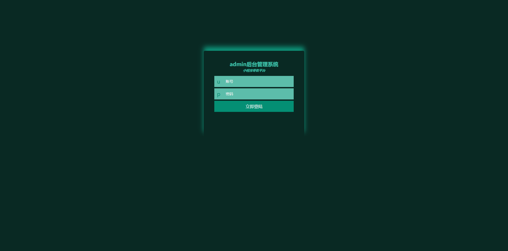
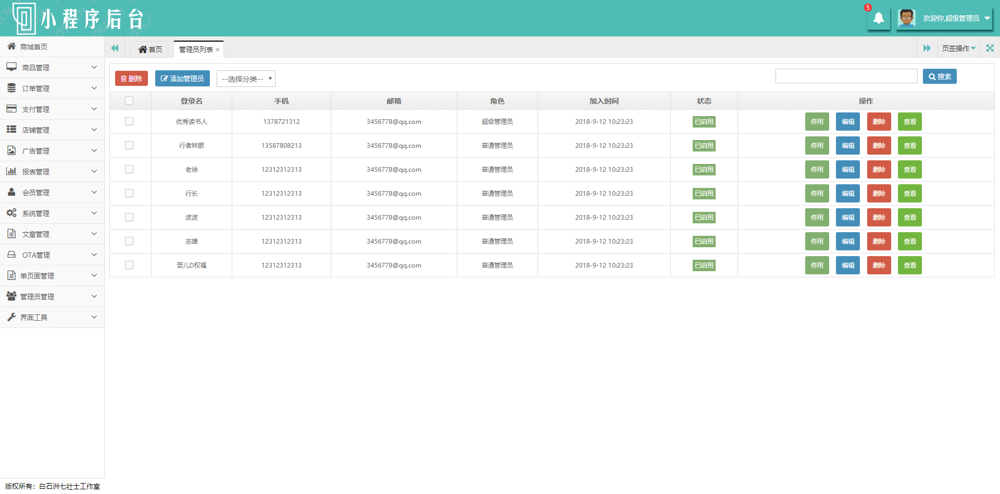

## Myadmin-template(代码测试可行再上传分享喜欢的可以star一下)
- 自己搭建的admin后台管理系统视图界面(包含boostrap版本，Iview  element,h-ui)各一套

## Boostra-template简介(代码还没测试通过路过的可别clone)
### 登陆界面统一这样(个人喜欢vue的绿色,健康。其他可以根据自己口味选择自己的login视图)

### boostrap后台模板界面简洁

- Datatables是一款jquery表格插件。它是一个高度灵活的工具，可以将任何HTML表格添加高级的交互功能。分页，即时搜索和排序/{使用者必须知道Datatables怎么使用}

