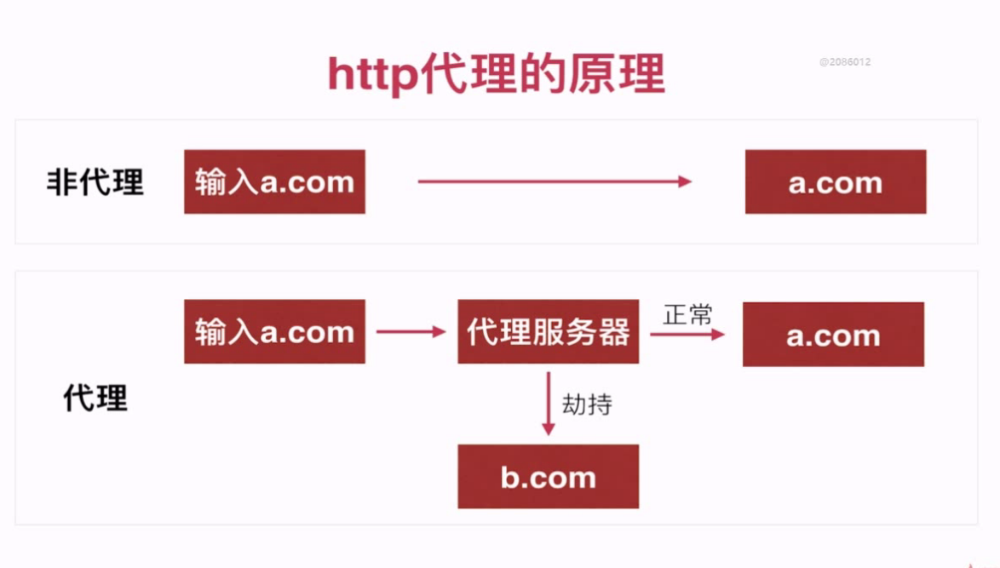

## font-template文档
- Fiddler使用




#### npm 介绍
```
	安装依赖包： npm install xxx@v.v.v
	卸载依赖包： npm uninstall xxx@v.v.v
	
	参数： -g
	
```
#### webpack
```
	设计思想： reuire anything
	加载方式： 各种loader插件
	编译方式： commonejs模块化 -> function 类型的模块
```
- webpack.config.js
1. entry 
2. externals: 外部依赖的声明
3. output: 输出目标文件
4. resolve: 配置别名

- webpack Loaders 加载器
1. html : html-wenpack-plugin /html-loader
2. js: babel-loader+babel-presets-es2015
3. css: style-loader + css-loader
4. image+font : url-loader

#### webpack 常用命令
1. webpack -p //发布时的打包，文件做最小化压缩
2. webpack
3. webpack --watch //静态文件改变自动编译=》开发过程
4. webpack --config wenpack.config.js //改变配置

#### webpack-dev-sever
- 前端： 开发服务器
- 特色： 可在文件改变时，自动刷新浏览器
- npm i wenpack-dev-servedr --save-dev ////webpack-dev-server/client?http://loaclhost:8088
- 使用： webpack-dev-server --port 8088 --inline // inline的意思是以脚本的方式插入到页面


 

	
